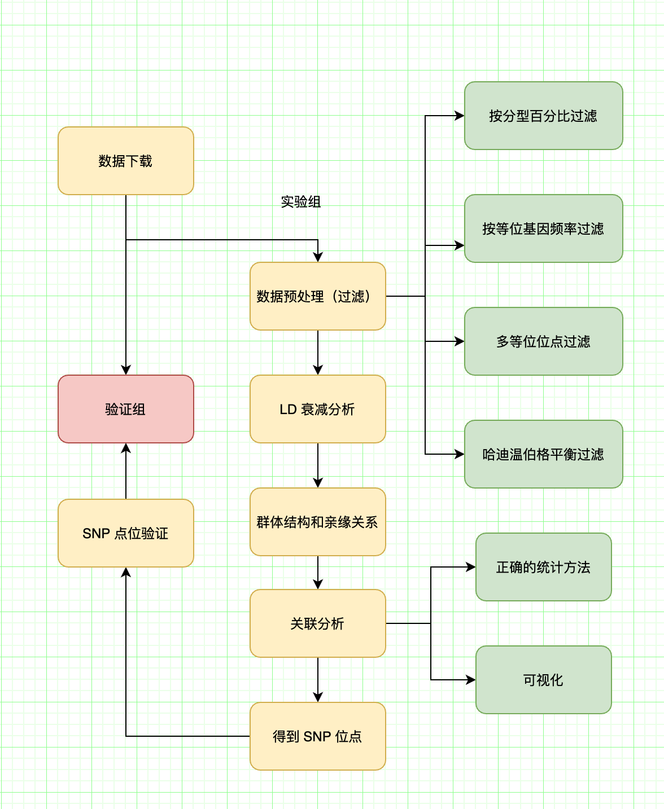

## GWAS 是什么
全基因组关联分析（Genome-wide association study）是指在人类全基因组范围内找出存在的序列变异，即单核苷酸多态性（SNP），从中筛选出与疾病相关的SNPs。

在全基因组范围内选择遗传变异进行基因分析，比较异常和对照组之间每个遗传变异及其频率的差异，统计分析每个变异与目标性状之间的关联性大小，选出最相关的遗传变异进行验证，并根据验证结果最终确认其与目标性状之间的相关性。

## GWAS 解决了什么问题
- 通过统计学的方式，寻找致病基因，做提前干预治疗

## GWAS 分析过程

## 数据质控

### 为什么需要数据质控

GWAS研究很少有引起偏差的来源，一般来说，一个人的基因型终其一生几乎不会改变的，因此很少存在同时影响表型又影响基因型的变异。但即便这样，我们在做GWAS时也要去除一些可能引起偏差的因素。

这种因素主要有：群体结构、个体间存在血缘关系（我们研究的是一个整体，亲缘关系会导致个体基因存在关联）、技术性操作。

### 质控方式
- 样本的质量控制
- SNP 质量控制

#### 样本质量控制
- 检查缺失率，通常情况下，将样本缺失率大于 5% 的个体去除
- 校验杂合性（需要符合哈迪温伯格，在理想状态下，各等位基因的频率和等位基因的基因型频率在遗传中是稳定不变的，即保持着基因平衡）
- 去除性别不一致的个体（基因型和实际表现性别）

#### SNP 位点的质量控制
- 去掉不符合哈温伯格平衡的SNP位点，P值小于0.00001；
- 去掉基因型缺失率大于2%的样本；
- 次等位基因频率低于1%的SNP位点；

## LD 衰减分析

## 存在缺点

## GWAS 依赖的知识点

