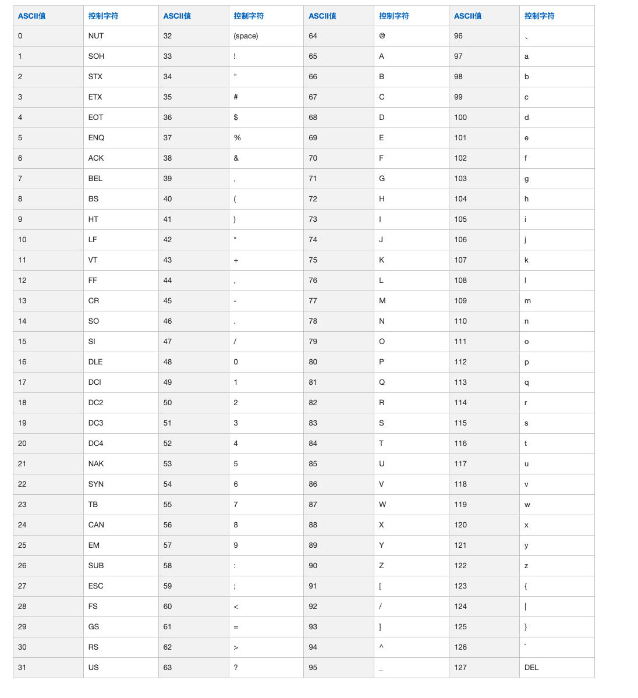
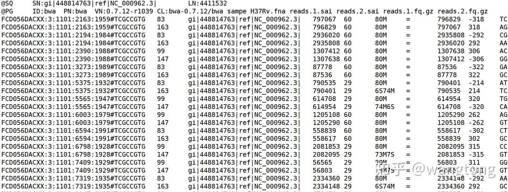

# 相关名词
## 基因组注释

## 简介
GFF和GTF是两种最常用的基因组注释格式，在信息分析中建库时除了需要fasta文件一般还会需要这两种文件，提取需要的信息进行注释。

GFF文件的全称是gene transfer format，主要是对染色体上的基因进行标注。怎么理解呢，其实所谓的基因名，基因座等，都只是后来人们给一段DNA序列起的名字而已，还原到细胞中就是细胞核里面的一条长长的染色体（DNA序列）。而这个GTF文件的主要功能，就是指出我们所谓的基因在染色体上的位置（coordinate），并且还标注了这一段区间的其他信息。

## GFF
GFF(General Feature Format)是一种用来描述基因组特征的文件，现在我们所使用的大部分都是第三版（gff3）。

gff 文件除 gff1 以外均由9列数据组成，前8列在gff的3个版本中信息都是相同的，只是名称不同。

gtf 文件是以 tab 键分割的 9 列组成，以下为每一列的对应信息：

注视格式：以 # 开头的注释

### seqid
参考序列的id。

### source
注释的来源。如果未知，则用点（.）代替。一般指明产生此gff3文件的软件或方法。

### type
类型，此处的名词是相对自由的，建议使用符合SO惯例的名称（sequenceontology），如gene，repeat_region，exon，CDS等。

### start
开始位点，从1开始计数（区别于bed文件从0开始计数）。


### end
结束位点

### score
得分，对于一些可以量化的属性，可以在此设置一个数值以表示程度的不同。如果为空，用点（.）代替。

### strand
步进。对于编码蛋白质的CDS来说，本列指定下一个密码子开始的位置。可以是0、1或2，表示到达下一个密码子需要跳过的碱基个数。


### attributes
属性。一个包含众多属性的列表，格式为“标签＝值”（tag=value），不同属性之间以分号相隔。

包含以下定义的标签：
- ID： 指定一个唯一的标识。对属性分类是非常好用（例如查找一个转录单位中所以的外显子）。
- Name： 指定属性的名称。展示给用户的就是该属性。
- Alias： 名称的代称或其它。当存在其它名称时使用该属性
- Note： 描述性的一些说明。  

Alias和Note可以有多个值，不同值之间以逗号分隔。
如：Alias=M19211,gna-12,GAMMA-GLOBULIN

[GFF 示例文件](./基因组源文件/Homo_sapiens.GRCh38.105.chromosome.MT.gff3) 


## fa,fasta,fna 文件
FASTA 文件主要用于存储生物的序列文件，例如基因组，基因的核酸序列以及氨基酸等，是最常见的生物序列格式
fasta 文件中，第一行是由大于号">"开头的任意文字说明，用于序列标记，为了保证后续分析软件能够区分每条序列，单个序列的标识必须是唯一的，序列ID部分可以包含注释信息。从第二行开始为序列本身，只允许使用既定的核苷酸或氨基酸编码符号。序列部分可以在一行，也可以分成多行。


eg:
```
>gi|556503834|ref|NC_000913.3|:190-255 Escherichia coli str. K-12 substr. MG1655, complete genome
ATGAAACGCATTAGCACCACCATTACCACCACCATCACCATTACCACAGGTAACGGTGCGGGCTGA
>gi|556503834|ref|NC_000913.3|:337-2799 Escherichia coli str. K-12 substr. MG1655, complete genome
ATGCGAGTGTTGAAGTTCGGCGGTACATCAGTGGCAAATGCAGAACGTTTTCTGCGTGTTGCCGATATTC
TGGAAAGCAATGCCAGGCAGGGGCAGGTGGCCACCGTCCTCTCTGCCCCCGCCAAAATCACCAACCACCT
GGTGGCGATGATTGAAAAAACCATTAGCGGCCAGGATGCTTTACCCAATATCAGCGATGCCGAACGTATT
TTTGCCGAACTTTTGACGGGACTCGCCGCCGCCCAGCCGGGGTTCCCGCTGGCGCAATTGAAAACTTTCG
TCGATCAGGAATTTGCCCAAATAAAACATGTCCTGCATGGCATTAGTTTGTTGGGGCAGTGCCCGGATAG
```

[fasta 示例文件](./基因组源文件/Danio_rerio.GRCz11.dna.chromosome.MT.fa) 

## fastq 文件格式
fastq 文件格式是用来存储测序文件的，它是含有 quality 的 fasta 文件。
eg:
```
@DJB775P1:248:D0MDGACXX:7:1202:12362:49613  
TGCTTACTCTGCGTTGATACCACTGCTTAGATCGGAAGAGCACACGTCTGAA  
+  
JJJJJIIJJJJJJHIHHHGHFFFFFFCEEEEEDBD?DDDDDDBDDDABDDCA  
@DJB775P1:248:D0MDGACXX:7:1202:12782:49716  
CTCTGCGTTGATACCACTGCTTACTCTGCGTTGATACCACTGCTTAGATCGG  
+  
IIIIIIIIIIIIIIIHHHHHHFFFFFFEECCCCBCECCCCCCCCCCCCCCCC 
```
### 第一行
以‘@’开头，是这一条read的名字，这个字符串是根据测序时的状态信息转换过来的，中间不会有空格，它是每一条read的唯一标识符，同一份 fastq 文件中不会重复出现，甚至不同的 fastq 文件里也不会有重复；

### 第二行
测序read的序列，由A，C，G，T和N这五种字母构成，这也是我们真正关心的DNA序列，N代表的是测序时那些无法被识别出来的碱基；


### 第三行
以‘+’开头，在旧版的 fastq 文件中会直接重复第一行的信息，但现在一般什么也不加（节省存储空间）； 

### 第四行
测序 read 的质量值，这个和第二行的碱基信息一样重要，它描述的是每个测序碱基的可靠程度，用 ASCII 码表示。

#### 质量值体系
我们知道，每个碱基测序的可靠程度是用 ASCII 表示的，可以转换成数字，如下表所示：

  

转换为数字后，越大质量越高 

## sam 文件
sam 文件主要用来存储短序列比对的结尾，是以TAB为分割符的文本格式， 主要应用于测序序列mapping到基因组上的结果表示。

sam 文件如下图所示：
   

### 第一列
是reads ID

### 第二列
是flag标记的总和

### 第三列
比对到参考序列上的染色体号。

### 第四列
在参考序列上的位置

### 第五列
比对的质量值，MAPQ

### 第六列
代表比对结果的CIGAR字符串

### 第七列
mate比对到的染色体号，若是没有mate，则是*

### 第八列
比对到参考序列上的第一个碱基位置

### 第九列
Template的长度

第十列：为read的序列
第十一列：为ASCII码格式的序列质量；
## 工具网站
[Ensembl](http://www.ensembl.org/info/data/ftp/index.html)  
是常用的信息齐全的参考基因组和GTF文件下载网站。

## 参考文章
[生信分析必须了解的4种文件格式](https://zhuanlan.zhihu.com/p/67195687)


