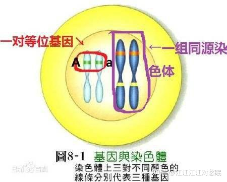

# GWA
Genome-wide association study， 全基因组关联分析，是指在人类全基因组范围内找出存在的序列变异，即单核苷酸多态性（SNP），从中筛选出与疾病相关的SNPs

# SNP
SingleNucleotide Polymorphism, 单核苷酸多态性,DNA序列中单个核苷酸的替代导致的、且分布于种群中相当一部分个体（如：1%以上）中的基因多样性。例如，对于某种生物，同一位置基因组片段一部分为AAGC**C**TA，另一部分为AAGC**T**TA，则认为此处存在SNP、两种基因型属于等位基因。

# 等位基因
allele 是指位于**一对** **同源染色体** **相同位置** 上控制同一性状不同形态的基因。  

   

# 增强子
增强子(enhancer)指增加同它连锁的基因转录频率的DNA序列。增强子是通过启动子来增加转录的。有效的增强子可以位于基因的5’端，也可位于基因的3’端，有的还可位于基因的内含子中。增强子的效应很明显，一般能使基因转录频率增加10～200倍，有的甚至可以高达上千倍

　
# 启动子
启动子是基因（gene）的一个组成部分，控制基因表达（转录）的起始时间和表达的程度。启动子（Promoters）就像“开关”，决定基因的活动

启动子通过与称为转录（transcription）因子的这种蛋白质（proteins）结合而控制基因活动的。转录因子就像一面“旗子”，指挥着酶（enzymes）(RNA聚合酶polymerases) 的活动。这种酶指导着RNA复制。基因的启动子部分发生改变（突变），则会导致基因表达的调节障碍。这种变化常见于恶性肿瘤。　

# 介导
介导指的是以一个中间步骤来传递或起媒介的作用。指把某种物质作为媒介转导某种物质，即将一种“物质”传递给另一种“物质”的过程和方式。

# CTCF
是由人类CTCF基因编码的转录因子, 转录阻抑物，也被称为11锌指蛋白或CCCTC结合因子

CTCF的主要功能是调控染色质的3D结构[6]。CTCF和DNA双链结合形成染色质环，并把DNA锚定在细胞结构上（例如核纤层）[7]。此外，CTCF还能充当常染色质和异染色质的边界。

# 绝缘子

# 沉默子
一段 DNA 序列，能够结合转录调节因子，这种转录因子称为阻遏蛋白。与增强子对DNA转录的加强作用相反，沉默子会抑制DNA的转录过程。

# 表观遗传修饰

# 限制性内切酶
是一种能将双股DNA切开的酶。它的切割方法是将糖类分子与磷酸之间的键结切断，进而于两条DNA链上各产生一个切口，且不破坏核苷酸与碱基。切割形式有两种，分别是可产生具有突出单股DNA的黏状末端，以及末端平整无凸起的平滑末端。

# 转录因子（TF）
转录因子(transcription factor，TF)是一类DNA结合蛋白，也称为反式作用因子。它能够结合到特定的DNA序列上，进而影响遗传信息从DNA转录到RNA。真核生物转录起始过程十分复杂，往往需要多种蛋白因子的协助，在介导和调控基因表达过程中，除RNA聚合酶之外，TF是在生命过程不同的阶段发挥重要作用的另一类蛋白质分子。

# 顺式作用元件
顺式作用元件（cis-regulatory element，CRE），是与结构基因串联的一段非编码 **DNA序列**，一般位于转录点上游，作用是调节邻近基因的转录。CREs是遗传调控网络的重要组成部分，进而控制形态发生、解剖学的发展以及胚胎发育的其他方面。

# 反式作用因子
Trans-acting factor），也称为反式因子，是指能直接或间接地识别或结合在各类顺式作用元件核心序列上，参与靶基因转录效率调控的 **蛋白质或RNA**。无论是原核生物还是真核生物，基因表达调节总是通过反式作用因子与顺式作用元件之间的作用来完成的。前者是蛋白质或RNA，后者是一段DNA或一段RNA。顺式是指DNA或RNA同一分子，反式是指不同分子

# DNA元件百科全书计划 
ENCODE，Encyclopedia of DNA Elements

是一个由美国国家人类基因组研究所(NHGRI)在2003年9月发起的一项公共联合研究项目[2]，旨在找出人类基因组中所有功能组件

# 表观基因组学路线图计划
Roadmap，Roadmap Epigenomics Project

# mRNA
信使核糖核酸，是由DNA经由转录而来，带着相应的遗传讯息，为下一步翻译成蛋白质提供所需的讯息

# 单细胞 RNA-seq

